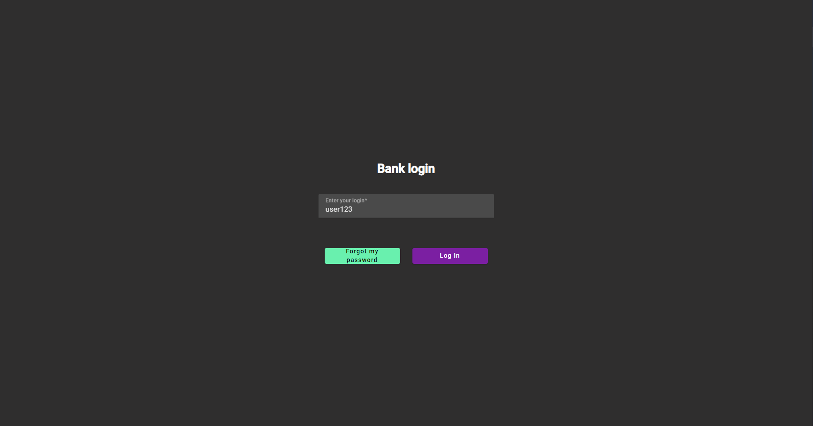
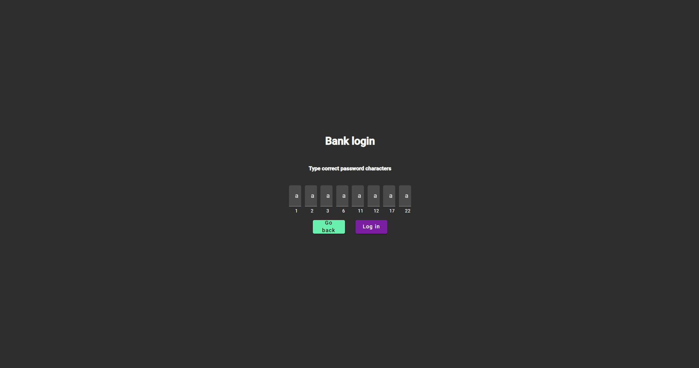
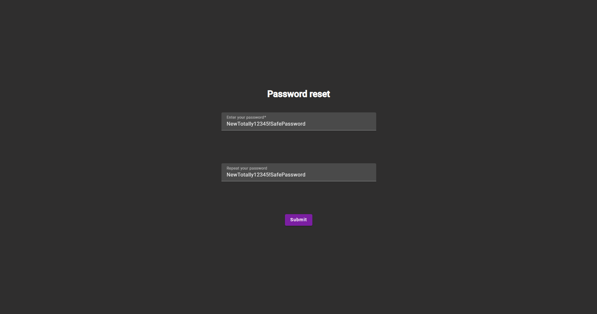
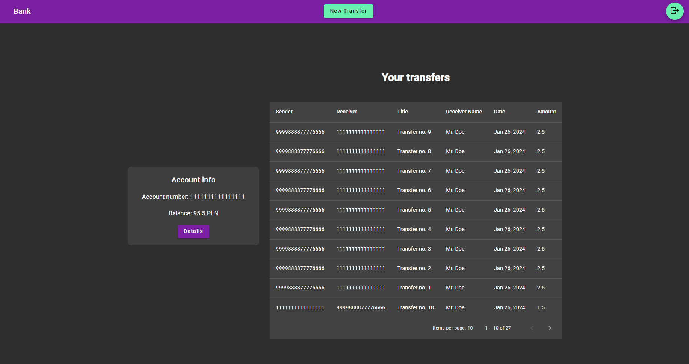
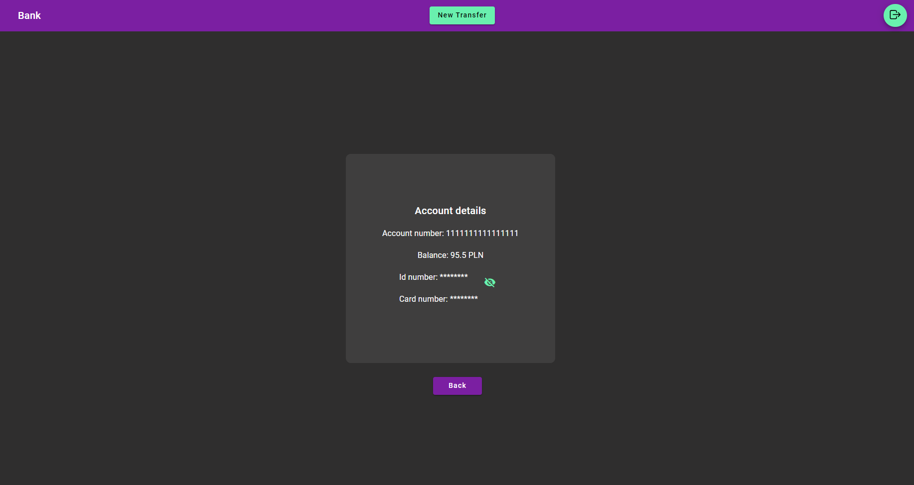
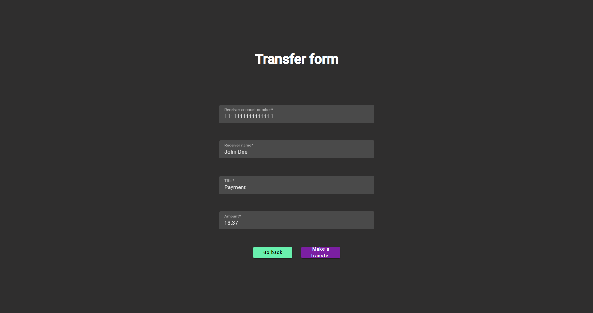

# Bank
Fullstack web app with an emphasis on security with basic functionality of bank (accounts, transfers). Key features:
 * JWT Authentication
 * Logging in using selected characters from password
 * Sensitive data encryption with AES based on key from PBKDF
 * Nginx proxy
 * All containers (except database) are secured with SSL
# How to run
Copy the content of example.env into .env:
```
cp example.env .env
```
and change the environmental variables if you want to. Then run
```
docker compose build
docker compose up -d
```
When all containers are ready (it takes a while for backend to start due to hashing) visit https://localhost

# Example users data
User 1:
```
username: user123
password: abcdefghijklmnoprsuwxyz
```

User 2:
```
username: user234
password: 1234567890abcdeghijkl
```

# Tech stack
1. Backend
   * Java 17
   * Spring Boot 3.1.5
   * Maven
   * Hibernate
   * SpringDataJPA
   * Postgresql
   * Lombok
   * Mapstruct
   * JJWT
    
2. Frontend
   * Angular 17
   * TypeScript
   * SCSS
   * Angular Material

3. Others
   * Docker
   * Nginx

# Screenshots

### Log in page


### Password log in page


### Change password page


### Main account page


### Account details page


### Create transfer page
